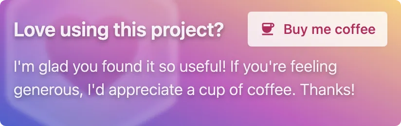

# My Sponsors

Thank you to all my sponsors! You're awesome ❤️

If you want to support my work, you can sponsor me on [GitHub Sponsors](https://github.com/sponsors/privatenumber).

## Banner

Dimensions: 412px × 130px

Placement: Top of page (somewhere above the fold)

	
	

## Badges

	

